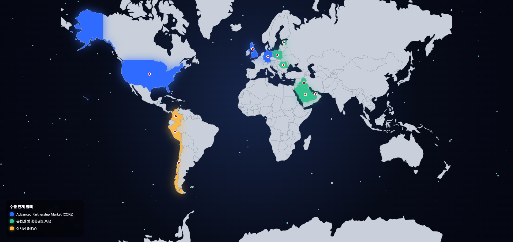

# 🚀 K-Defense Global Expansion Strategy Platform




데이터 기반 분석을 통해 **한국 방산 기업의 글로벌 진출 전략**을 도출하는 프로젝트입니다.  
글로벌 방산 시장 데이터를 수집하고 분석하여 **권역별 수요를 파악하고 기업별 전략을 제안**합니다.

---

# 📊 Project Overview

최근 글로벌 국방비 증가와 국제 안보 환경 변화로 인해  
**방산 시장 수요가 급격히 확대**되고 있습니다.

본 프로젝트는 다음을 수행합니다.

- 🌍 글로벌 방산 시장 데이터 수집
- 📊 권역별 시장 세분화
- 🔎 방산 수요 분석
- 🏭 한국 방산 기업과 글로벌 시장 매칭
- 📈 전략 도출 및 웹 기반 시각화

---

# 🧭 Project Workflow


DATA → SELECTION → ANALYSIS → STRATEGY → WEB

---

# 📂 1. Data Collection


수집 데이터

- DART API (기업 공시 데이터)
- News API
- RSS Feed
- 글로벌 방산 전시회
- 글로벌 방산 시장 데이터

---

# 🌎 2. Market Selection

글로벌 방산 시장을 **3개 그룹**으로 세분화합니다.

| Group | Description |
|------|-------------|
| Group 1 | 기술 선진국 |
| Group 2 | 신흥 방산 수요 시장 |
| Group 3 | 신규 시장 |


---

# 🔍 3. Market Analysis

권역별 주요 방산 수요 분석

| Region | Demand |
|------|------|
| Eastern Europe | K9 Self-Propelled Artillery / K2 Tank |
| Middle East | Drone / Missile |
| South America | Jet / Aircraft |

---

# 🎯 4. Strategy

한국 방산 기업과 글로벌 시장 매칭 전략

| Region | Target Company |
|------|----------------|
| USA / UK / Germany | Hanwha Aerospace |
| Eastern Europe | Hyundai Rotem |
| Middle East | LIG Nex1 |
| South America | Korea Aerospace Industries |

---

# 💻 5. Web Platform

분석 결과를 **웹 플랫폼으로 시각화하여 제공**

Features

- 글로벌 방산 시장 분석
- 국가별 방산 수요 시각화
- 기업-시장 매칭 전략
- 데이터 기반 전략 제안

---

# 📁 Repository Structure

```
K-Defense-Global-Expansion
│
├─ frontend         # React 기반 프론트엔드
├─ backend          # Python 기반 백엔드 API
├─ assets           # 이미지 / 시각화 결과
├─ docs
│   └─ reference
│       └─ k_방산 글로벌화 전략.pdf
└─ README.md
```

---

# 🏭 Target Companies

본 프로젝트는 다음 한국 방산 기업을 중심으로 분석합니다.

- Hanwha Aerospace
- Hyundai Rotem
- LIG Nex1
- Korea Aerospace Industries
- Hanwha Systems
- Poongsan

---

# ⚡ Getting Started

로컬에서 프로젝트를 실행하는 방법입니다. (Windows / Python 3.10+ / Node 18+)

## 1. Clone

```bash
git clone https://github.com/pbzz1/K-Defense-Dashboard.git
cd K-Defense-Dashboard
```

## 2. Backend (Flask, port 5000)

```bash
cd backend
python -m venv .venv
.venv\Scripts\activate
pip install -r requirements.txt
```

`backend/.env` 파일을 만들고 한국투자증권 OpenAPI 키를 넣습니다.
(키가 없으면 서버가 시작 시 `RuntimeError`로 종료됩니다.)

```
KIS_APP_KEY=your_app_key
KIS_APP_SECRET=your_app_secret
```

```bash
python app.py
```

→ http://localhost:5000

## 3. Frontend (React, port 3000)

새 터미널에서:

```bash
cd frontend
npm install
npm start
```

→ http://localhost:3000

프론트엔드는 API 주소를 `http://localhost:5000`으로 하드코딩해서 호출하므로,
백엔드를 먼저 띄운 상태에서 사용해야 합니다.

## Notes

- 차트의 한글 라벨은 `C:/Windows/Fonts/malgun.ttf`(맑은 고딕)를 사용합니다. macOS / Linux에서는 `backend/app.py`의 `FONT_PATH`를 수정해야 합니다.
- `backend/services/marketstack.py`는 `MARKETSTACK_API_KEY` 설정이 필요하며 현재 `app.py`에 연결되어 있지 않습니다.
- 배포용 정적 빌드는 `cd frontend && npm run build`.

---

# 🛠 Tech Stack

| Category | Technology |
|--------|------------|
| Language | Python |
| Frontend | React |
| Data | Web Crawling |
| API | DART API / News API |
| Data Source | RSS |
| Analysis | Data Analysis |
| Visualization | Data Visualization |

---

# 📚 Reference

docs/reference/k_방산 글로벌화 전략 (박사님과 싱싱미역줄기들).pdf

---

# 👨‍💻 Team

**ACON Project**

- 김다은
- 김태훈
- 양유민
- 조성진
- 조준형
